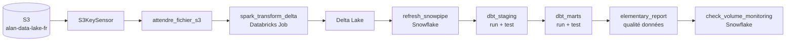

# airflow-sirene

Pipeline Data Engineering orchestré - Airflow, PySpark, Snowflake, dbt, Docker


Pipeline end-to-end orchestrant les données SIRENE (établissements actifs,
source : [data.gouv.fr](https://www.data.gouv.fr)).
Stack : **S3 → PySpark/Databricks → Snowflake → dbt → Elementary**.

---

## Architecture



---

## Stack technique

| Outil | Version | Rôle |
|-------|---------|------|
| Apache Airflow | 3.2.1 | Orchestration des DAGs |
| PySpark / Databricks | 3.5 | Transformation distribuée |
| Delta Lake | - | Stockage analytique (ACID, Time Travel) |
| Snowflake | - | Data warehouse |
| dbt Core | - | Modélisation (staging + intermediate + marts) |
| Elementary | - | Qualité et observabilité des données |
| AWS S3 | eu-west-1 | Stockage fichiers source |
| Docker Desktop | - | Environnement local Airflow |
| GitHub Actions | - | CI/CD - validation syntaxe DAGs |

---

## Setup local

```powershell
git clone https://github.com/Alanandre01/airflow-sirene.git
cd airflow-sirene
cp .env.example .env   # Renseigner SNOWFLAKE_*, AWS_*, DATABRICKS_*, FERNET_KEY (voir CLAUDE.md)
docker compose up -d
# Ouvrir http://localhost:8080  (airflow / airflow)
# Déclencher dag_06_sirene_pipeline_v2 depuis l'interface Airflow
```

---

## DAGs disponibles

| DAG | Tâches | Description |
|-----|--------|-------------|
| `dag_01_sirene_etl_demo` | 3 | TaskFlow API + XComs implicites |
| `dag_02_sirene_branch_demo` | 4 | BranchPythonOperator + trigger_rule |
| `dag_03_sirene_s3_dbt_pipeline` | 4 | S3KeySensor → dbt run + test |
| `dag_04_sirene_databricks` | 5 | S3 → Databricks → Snowpipe → validation RAW |
| `dag_05_sirene_pipeline_complet` | 11 | Pipeline complet - schedule `0 5 1 * *` |
| `dag_06_sirene_pipeline_v2` | 9 | Variante allégée - schedule hebdomadaire, callbacks, `max_active_runs=1` |

---

## RGPD

- **Filtre SIRENE** : `STATUT_DIFFUSION != 'P'` - écarte les établissements
  ayant exercé leur droit d'opposition (Art. 21 RGPD).
- **Rôles Snowflake séparés** (voir `GOVERNANCE.md` du repo `sirene_nantes`) : `TRANSFORMER` (dbt CI/CD),
  `ANALYST` (lecture marts), `SYSADMIN` (administration).
- **Rétention** : `DATA_RETENTION_TIME_IN_DAYS` par table - voir
  `GOVERNANCE.md` (repo sirene_nantes).
- **Audit** : table `ALAN_DW.RAW.RGPD_AUDIT_LOG` +
  procédure `ANONYMISER_ETABLISSEMENT`.

---

## Tests

```bash
docker compose exec airflow-apiserver python -m pytest /opt/airflow/tests/ -v --tb=short
```

16 tests pytest de validation structurelle (`DagBag`) : absence d'erreurs d'import, DAGs
attendus, tags, task_ids, dépendances, `max_active_runs`, TaskGroups dbt.

